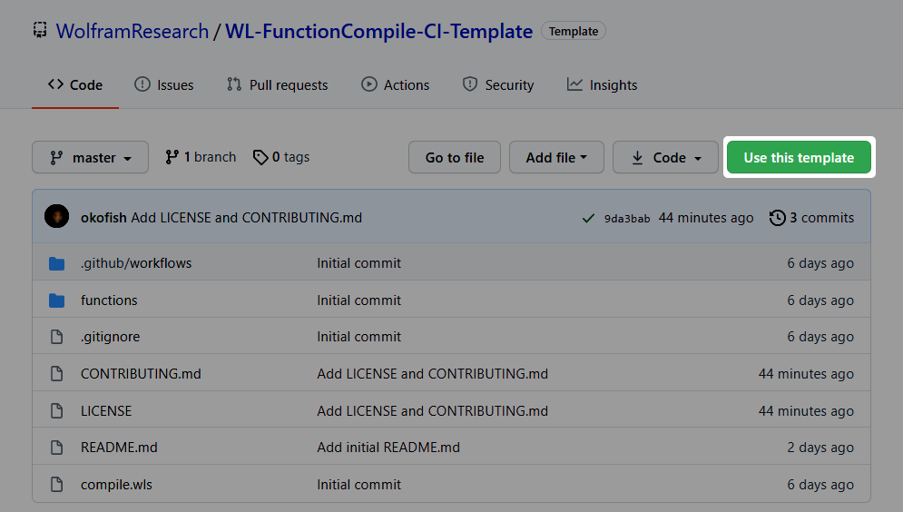
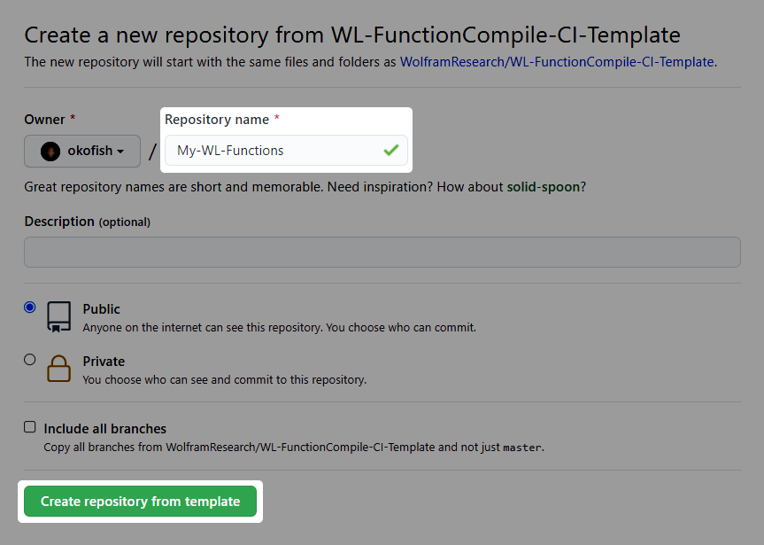
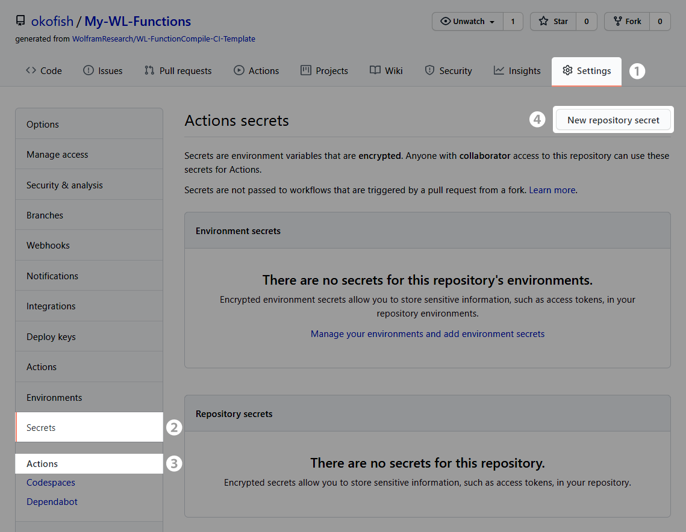
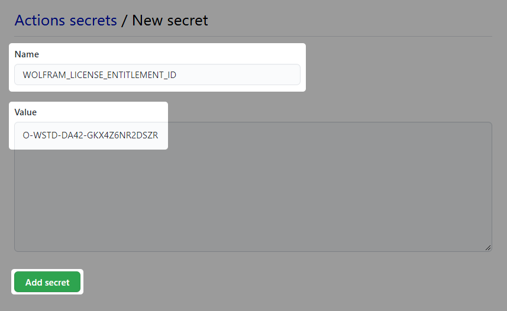
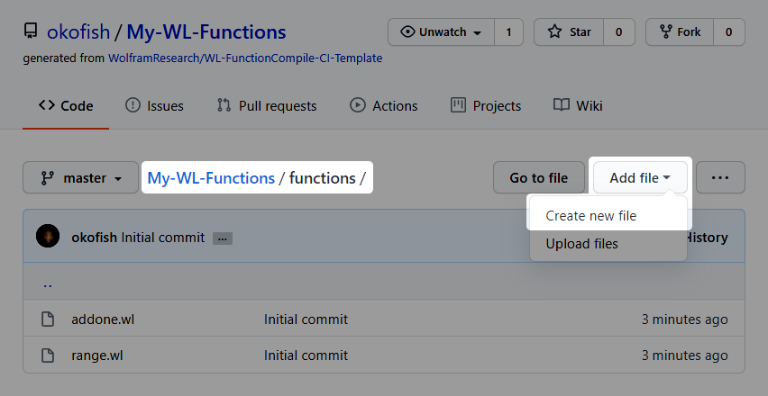
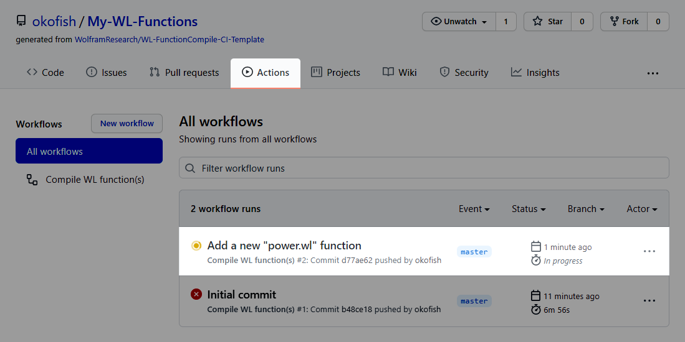
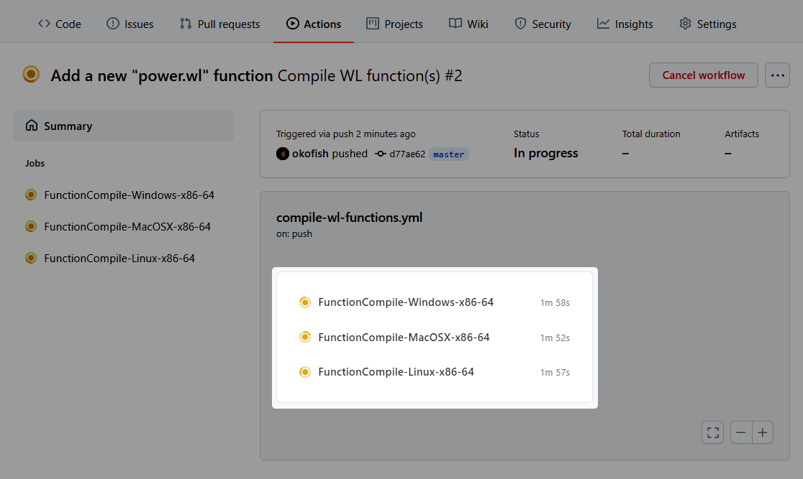
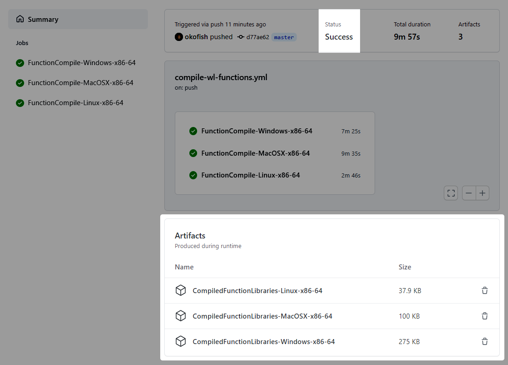

# Wolfram Language FunctionCompile CI template

This repository is a template illustrating [compilation of Wolfram Language functions](https://reference.wolfram.com/language/guide/CodeCompilation.html) as part of a continuous integration (CI) workflow using [GitHub Actions](https://github.com/features/actions).
The [GitHub Actions workflow](.github/workflows/compile-wl-functions.yml) and corresponding [Wolfram Language script](compile.wls) in this repository run automatically on each push, and compile the function source files in the [`/functions`](functions) directory into shared libraries for macOS (Apple Silicon not yet supported), Windows, and Linux.
These shared libraries are suitable for linking into external programs, and can also be loaded into a Wolfram Language kernel at runtime using [`LibraryFunctionLoad`](https://reference.wolfram.com/language/ref/LibraryFunctionLoad.html).


## Using this template

### 1. Create a new repository from the template

Click the **Use this template** button above the file listing view:



Enter a name for your new repository and click **Create repository from template**:



This will copy the contents of the template repository, including the GitHub Actions configuration and this README.md file, into a new repository in your account (or the selected organization account).

You may mark your new repository as either public or private. Bear in mind, however, [GitHub Actions' billing policies](https://docs.github.com/en/github/setting-up-and-managing-billing-and-payments-on-github/about-billing-for-github-actions) regarding repository privacy.


### 2. Create an on-demand license entitlement

After creating your repository from the template, GitHub Actions will immediately attempt to run the [compilation workflow](.github/workflows/compile-wl-functions.yml) in the repository.
This initial run will fail, as the [Wolfram Engine](https://www.wolfram.com/engine/) kernel used for function compilation will be unable to obtain a license, or ["activate"](https://reference.wolfram.com/language/tutorial/ActivatingMathematica.html).
(You may receive an email notification of this failed workflow run.)
In order to ensure the Wolfram Engine can activate, we will use **on-demand licensing**.

On-demand licensing is a pay-as-you-go licensing method whereby Wolfram Engine usage is billed against your [Wolfram Service Credits](https://www.wolfram.com/service-credits/) balance at a per-kernel-hour rate.
This method allows you to run arbitrary numbers of concurrent Wolfram Engine kernels for pennies per kernel per hour, and to scale up and down in a cost-effective manner.
You may use the starter Service Credits quota available with a free Wolfram Cloud Basic account for initial experimentation before purchasing more Service Credits.

An on-demand license entitlement is a reusable license key that can be used to activate one or more Wolfram Engine kernels.
Creating an entitlement requires access to the Wolfram Language.
If you do not have [Wolfram Mathematica](https://www.wolfram.com/mathematica/), a [Wolfram|One](https://www.wolfram.com/wolfram-one/) subscription or another Wolfram Language product, you can sign up for a free [Wolfram Cloud Basic](https://www.wolframcloud.com/) subscription and create an entitlement from within a cloud notebook.

Use the [`CreateLicenseEntitlement` function](https://reference.wolfram.com/language/ref/CreateLicenseEntitlement.html) to create a new license entitlement linked to your Wolfram Account:
```wl
In[1]:= entitlement = CreateLicenseEntitlement[<|
    "StandardKernelLimit" -> 6, 
    "LicenseExpiration" -> Quantity[1, "Hours"], 
    "EntitlementExpiration" -> Quantity[1, "Years"]
|>]

Out[1]= LicenseEntitlementObject["O-WSTD-DA42-GKX4Z6NR2DSZR", <|
    "PolicyID" -> "WSTD", "PolicyName" -> "Standard", "BillingInterval" -> Quantity[900, "Seconds"],
    "KernelCosts" -> <|
        "Standard" -> Quantity[4., "Credits"/"Hours"],
        "Parallel" -> Quantity[4., "Credits"/"Hours"]
    |>,
    "KernelLimits" -> <|"Standard" -> 6, "Parallel" -> 0|>,
    "CreationDate" -> DateObject[{2021, 4, 26, 14, 28, 18.}, "Instant", "Gregorian", -4.],
    "ExpirationDate" -> DateObject[{2022, 4, 26, 14, 28, 18.}, "Instant", "Gregorian", -4.],
    "LicenseExpirationDuration" -> Quantity[MixedMagnitude[{0, 1.}], MixedUnit[{"Days", "Hours"}]]
|>]
```

Take note of the returned entitlement ID (`O-WSTD-DA42-GKX4Z6NR2DSZR` above); you will need it in the next step.

The meanings of the specified entitlement settings are:
- `"StandardKernelLimit" -> 6`: Up to six kernels may run concurrently. (This means two copies of the three-OS compilation workflow.)
- `"LicenseExpiration" -> Quantity[1, "Hours"]`: Each kernel may run for up to one hour at a time.
- `"EntitlementExpiration" -> Quantity[1, "Years"]`: The entitlement expires one year after creation. (This means you must create a new entitlement and replace the GitHub secret once a year.)

You may adjust these settings as needed for your use case. For more information, see the documentation for [`CreateLicenseEntitlement`](https://reference.wolfram.com/language/ref/CreateLicenseEntitlement.html).

_If you are using GitHub Actions [self-hosted runners](https://docs.github.com/en/actions/hosting-your-own-runners/about-self-hosted-runners), and you or your organization has a [MathLM](https://reference.wolfram.com/language/tutorial/WhatIsMathLM.html) server, you may able to activate the Wolfram Engine using MathLM instead of on-demand licensing.
This would involve modifying the jobs in the [workflow file](.github/workflows/compile-wl-functions.yml) to each create a [`mathpass` file](https://reference.wolfram.com/language/tutorial/RegistrationAndPasswords.html#46656280) containing the hostname of your MathLM server._


### 3. Create a repository secret containing your entitlement ID

A license entitlement ID is a form of license key, and so for reasons of security should not be stored directly in the source tree of a repository, especially if that repository is public.
We will instead store it in an [encrypted repository secret](https://docs.github.com/en/actions/reference/encrypted-secrets) that can be accessed by code running in GitHub Actions jobs.

Open the **Actions secrets** repository settings page (**Settings > Secrets > Actions**) and click **New repository secret**:



Name the new secret `WOLFRAM_LICENSE_ENTITLEMENT_ID` and paste your entitlement ID from step 2 as the value, then click **Add secret**:



Make sure to remove any extraneous whitespace from either side of the entitlement ID.


### 4. Add a new function to the repository

The [compilation script](compile.wls) compiles function source files in the [`/functions`](functions) directory of the repository.
A function source file must have `.wl`, `.m`, `.wxf`, or `.mx` as its extension.
Files in subdirectories of `/functions` (e.g. `/functions/subdir/file.wl`) are ignored. Resulting compiled libraries are named with the base name of the source function file, so `/functions/addone.wl` is compiled to `addone.dylib` (or `.dll` or `.so`, depending on the target operating system).

Each function source file (e.g. [`/functions/addone.wl`](functions/addone.wl)) should return a [`Function`](https://reference.wolfram.com/language/ref/Function.html) expression with the appropriate [type annotations](https://reference.wolfram.com/language/ref/Typed.html) for compilation with [`FunctionCompile`](https://reference.wolfram.com/language/ref/FunctionCompile.html)/[`FunctionCompileExportLibrary`](https://reference.wolfram.com/language/ref/FunctionCompileExportLibrary.html).

You can commit and push a new function source file to your repository using the [Git command-line interface](https://docs.github.com/en/github/managing-files-in-a-repository/adding-a-file-to-a-repository-using-the-command-line) or a graphical Git tool like [GitHub Desktop](https://desktop.github.com/),
or you can use [the GitHub web interface](https://docs.github.com/en/github/managing-files-in-a-repository/creating-new-files).
The web interface is the easiest option for a quick test of your newly configured repository.

Navigate to the [`/functions`](functions) directory listing and click **Add file > Create new file**:



Name the file `power.wl` and paste the following as its contents:
```wl
Function[Typed[num, "MachineInteger"], num ^ num]
```

Optionally edit the commit message, and then click **Commit new file**:

!["Commit new file" screen showing new file named "power.wl" with "Function[...]" as contents](.github/images/6-Commit-new-file.png)


### 5. Download and use a compiled function library

If you switch to the **Actions** tab, you should see the new workflow run triggered by your commit in step 4:



Click on the run to see the status of each job in the run:



This initial run may take 10-15 minutes to finish.
Once all jobs succeed, the produced artifacts will be displayed beneath the list of jobs:



Each artifact is a compressed ZIP file containing the compiled function libraries for the platform indicated in its name.
Download and uncompress the artifact for your platform of choice.

Load the compiled function library for the new `power` function into a Wolfram Language session using [`LibraryFunctionLoad`](https://reference.wolfram.com/language/ref/LibraryFunctionLoad.html):
```wl
In[2]:= func = LibraryFunctionLoad["/path/to/CompiledFunctionLibraries-MacOSX-x86-64/power.dylib"]

Out[2]= CompiledCodeFunction[...]
```

The loaded function can be now used interactively and in code:
```wl
In[3]:= func[42]

Out[3]= 150130937545296572356771972164254457814047970568738777235893533016064
```